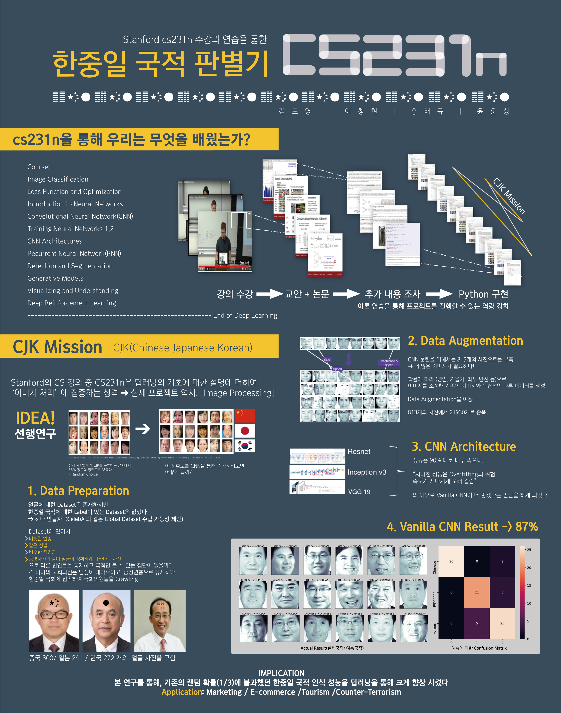

# CJK_Mission

해당 Repository는 동양인, 그 중 한중일 국민들에 대하여 국적을 판별해내는 판별기입니다.

한중일 국민들은, 서로를 바라봤을 때는 판별이 비교적 용이하지만, 이외의 국민들에겐 그들을 구분하는 것은 매우 난해한 문제이며, 이로 인해 한국인에게 중국인, 일본인이라고 칭하는 문제가 발생하곤 합니다.

따라서 CJK 문제를 Deep Learning Vision으로 풀어나가기 위해 프로젝트를 진행했습니다.

